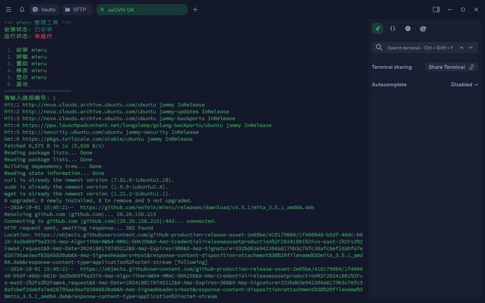

## 终端预览




## 一键脚本
```
bash <(curl -fsSL https://raw.githubusercontent.com/passeway/mieru/main/mieru.sh)
```
## 详细说明
- 提供 socks5, HTTP 和 HTTPS 代理接口。
- 不使用 TLS 协议，无需注册域名和架设伪装站点。
- 使用随机填充与重放攻击检测阻止 GFW 探测 mieru 服务。
- 使用高强度的 XChaCha20-Poly1305 加密算法，基于用户名、密码和系统时间生成密钥。

## 项目地址：https://github.com/enfein/mieru
